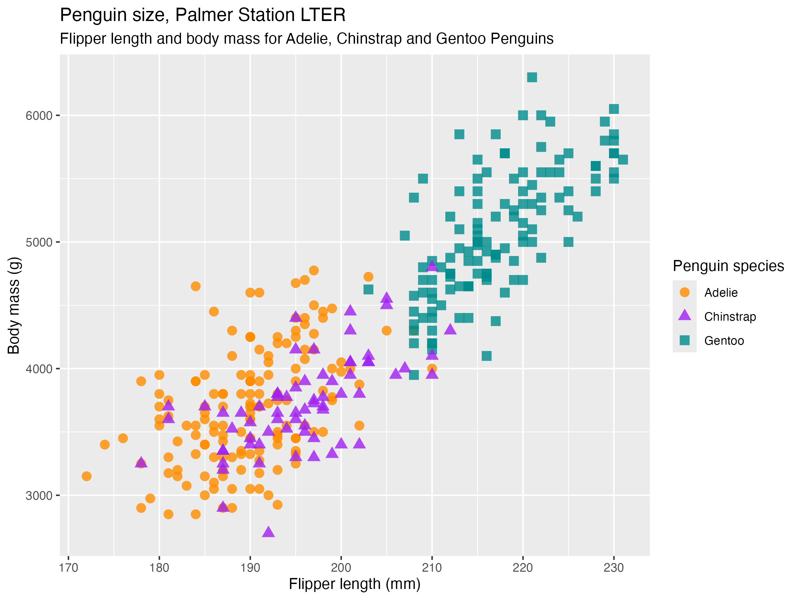

```{r setup, include = FALSE}
knitr::opts_chunk$set(
  echo = TRUE # print code
)
```

# Intro

This is a starter file for your "Prepare Data" script.
This script should update the data file(s) by re-exporting, merging, re-running calculations, etc.
This script should be separate from the "Computational Notebook" file that is used for running analyses on the data.
Every time you run the "Computational Notebook" file with the exact same data, you should get the exact same findings (i.e., reproducibility).
Thus, we keep the "Prepare Data script" separate from the "Computational Notebook" file so that you update the data only when you intend to.

This document is an [R Markdown](http://rmarkdown.rstudio.com) Notebook, which is an example of a computational notebook.
Best practices for using Markdown are in the Lab Wiki here: https://devpsylab.github.io/DataAnalysis/markdown.html#bestPractices.
Steps for working with computational notebooks are located in the Lab Wiki here: https://devpsylab.github.io/DataAnalysis/markdown.html#computationalNotebook

## Risultati dell'Analisi

```{r, echo=FALSE}
library(knitr)
library(tidyverse)
library(rio)
library(here)
```

```{r}
risultati <- rio::import(here::here("reports", "risultati_analisi.csv"))
kable(risultati)
```
```{r include-png, echo=FALSE, out.width='100%', fig.align='center'}

```

This concludes the report.
